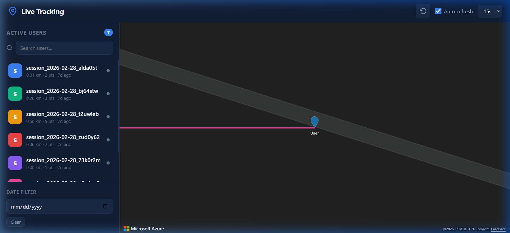

# D365 Live Tracking — Azure Maps

> Real-time GPS location tracking for Dynamics 365 CRM, visualised on Azure Maps.


---

## Screenshots

| Mobile App | Live Tracking Map |
|---|---|
|  |  |

> The Azure Maps web resource runs **inside Dynamics 365** — no extra hosting needed.

---

## What It Does

| Feature | Details |
|---|---|
| 📱 Mobile App | React Native (Expo) — iOS & Android |
| 🔐 Authentication | Azure AD (Entra ID) OAuth2 / PKCE |
| 📍 GPS Tracking | 5-second intervals, 2-metre minimum distance filter |
| ☁️ Sync | OData batch upload to D365 Dataverse |
| 🗺️ Map Dashboard | Azure Maps web resource embedded in D365 |
| 📜 History | Session replay per user in the mobile app |
| 📶 Offline Mode | Location queue with auto-retry on reconnect |

---

## Quick Start

### Prerequisites
- Dynamics 365 CRM environment (System Customizer role)
- Azure AD App Registration — see [docs/azure-ad-config.md](docs/azure-ad-config.md)
- Azure Maps subscription key — from [portal.azure.com](https://portal.azure.com)
- Node.js 18+, Expo Go on your phone

### Mobile App Setup
```bash
cd mobile-app
npm install
npx expo start -c
```

Scan the QR code with **Expo Go** on your device.

📖 Full setup instructions: [docs/setup-guide.md](docs/setup-guide.md)

---

## Repository Structure

```
.
├── mobile-app/                   # Expo React Native app
│   ├── app/                      # Expo Router screens
│   │   ├── (auth)/login.tsx      # Connection setup + sign-in
│   │   └── (tabs)/               # Dashboard, History, Settings
│   └── src/
│       ├── auth/AuthProvider.tsx  # Token management (SecureStore)
│       ├── constants/config.ts    # D365_CONFIG, LOCATION_CONFIG, theme
│       ├── services/
│       │   ├── D365Client.ts      # OData Web API client
│       │   ├── LocationService.ts # GPS engine + session manager
│       │   └── TrackingManager.ts # Upload pipeline (batch + retry)
│       └── types/index.ts         # TrackingRecord, TrackingHistoryEntry
│
├── crm-webresource/              # D365 web resource (map dashboard)
│   ├── html/LiveTrackingMap.html  → upload as: cr971_LiveTrackingMapHTML
│   ├── css/LiveTrackingMap.css    → upload as: cr971_LiveTrackingMapCSS
│   └── js/LiveTrackingMap.js      → upload as: cr971_LiveTrackingMapJS
│
├── images/
│   ├── mobile_app/               # Mobile app screenshots
│   └── web_app/                  # CRM map dashboard screenshots
│
└── docs/
    ├── setup-guide.md             # End-to-end deployment guide
    ├── crm-entity-setup.md        # Entity + field creation steps
    ├── azure-ad-config.md         # App registration walkthrough
    ├── architecture.md            # System design + data flow
    └── admin-user-guide.md        # Daily use for admins and reps
```

---

## Key Configuration

### Publisher Prefix
All Dataverse entity and field names use the prefix **`cr971_`** — fixed for all deployments.

Field names are centralised in `D365_CONFIG.fields` in `src/constants/config.ts`:

```typescript
export const D365_CONFIG = {
    entityPrefix:   'cr971_',
    trackingEntity: 'cr971_livetrackings',
    fields: {
        latitude:   'cr971_latitude',
        longitude:  'cr971_longitude',
        timestamp:  'cr971_timestamp',
        sessionId:  'cr971_sessionid',
        // ... see config.ts for full list
    },
};
```

### Runtime Configuration (per client)
Only two values are entered by the user at first app launch — no code changes needed per deployment:

| Value | Who provides it |
|---|---|
| Azure AD Client ID | IT Admin |
| Dynamics 365 URL | IT Admin (e.g. `https://yourorg.crm.dynamics.com`) |

Stored securely in the device Keychain via `expo-secure-store`.

### Azure Maps Key
Before uploading the web resource, replace the placeholder in `crm-webresource/js/LiveTrackingMap.js`:

```js
const CONFIG = {
    azureMapsKey: 'YOUR_AZURE_MAPS_SUBSCRIPTION_KEY',  // ← replace this
    ...
};
```

---

## Documentation

| Doc | Purpose |
|---|---|
| [Setup Guide](docs/setup-guide.md) | Full end-to-end deployment walkthrough |
| [CRM Entity Setup](docs/crm-entity-setup.md) | Entity and custom field creation |
| [Azure AD Config](docs/azure-ad-config.md) | App registration and permissions |
| [Architecture](docs/architecture.md) | System design, data flow, and design decisions |
| [Admin & User Guide](docs/admin-user-guide.md) | Day-to-day usage for admins and sales reps |

---

## License

This project is open source and available under the [MIT License](LICENSE).
